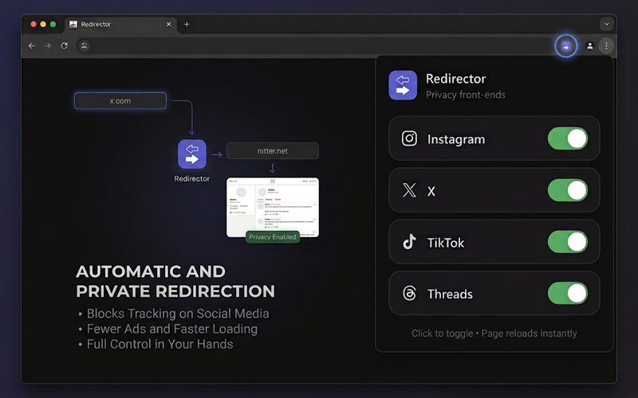

# Social Media Redirector

[](https://karayelxyz.github.io/social-media-redirector)
[](LICENSE)

A browser extension that redirects social media pages to privacy-respecting front-ends.

| Platform | Original | Redirect |
|----------|----------|----------|
| Instagram | instagram.com | imginn.com |
| X | x.com | nitter.us.catsarch.com |
| TikTok | tiktok.com | exporttok.com |
| Threads | threads.com | shoelace.mint.lgbt |

## Installation

[](https://chromewebstore.google.com/detail/social-media-redirector/gckenkjdlidnignifbbobohimoilmgcg)
[](https://addons.mozilla.org/en-US/firefox/addon/social-media-redirector/)

### Manual (developer mode)

**Chrome:**
1. Download the [latest release](https://github.com/karayelxyz/social-media-redirector/releases) (zip or crx)
2. Open `chrome://extensions/`
3. Enable **Developer mode**
4. Click **Load unpacked** and select the `social-media-redirector` folder

**Firefox:**
1. Download the [latest release](https://github.com/karayelxyz/social-media-redirector/releases) (signed .xpi)
2. Open `about:addons`
3. Click the gear icon → **Install Add-on From File**
4. Select the `.xpi` file

## Bookmarklet (no extension required)

Works on any browser (iOS Safari, Firefox, etc.). Create a new bookmark and paste the following as the URL:

```
javascript:(function(){var%20u=new%20URL(window.location.href),h=u.hostname,p=u.pathname,s=u.searchParams,m;if(h.indexOf(%27instagram.com%27)>=0){if(p.indexOf(%27/accounts/login%27)>=0){var%20n=s.get(%27next%27);if(n){var%20pt=n.indexOf(%27http%27)===0?new%20URL(n).pathname:n.split(%27?%27)[0];var%20al=[%27/explore%27,%27/direct%27,%27/accounts%27,%27/about%27,%27/hacked%27,%27/privacy%27,%27/popular%27];if(!al.some(function(x){return%20pt.indexOf(x)===0})){if(m=pt.match(/\/(?:p|reels?)\/([^/]+)/)){window.location.href=%27https://imginn.com/p/%27+m[1]+%27/%27;return}if(m=pt.match(/\/([^/]+)\/reels?/)){window.location.href=%27https://imginn.com/reels/%27+m[1]+%27/%27;return}if(m=pt.match(/\/([^/]+)\/tagged/)){window.location.href=%27https://imginn.com/tagged/%27+m[1]+%27/%27;return}if(m=pt.match(/\/stories\/([^/]+)/)){window.location.href=%27https://imginn.com/stories/%27+m[1]+%27/%27;return}if(m=pt.match(/\/([^/?#]+)/)){window.location.href=%27https://imginn.com/%27+m[1]+%27/%27;return}}}return}var%20a=[%27/explore%27,%27/direct%27,%27/accounts%27,%27/about%27,%27/hacked%27,%27/privacy%27,%27/popular%27];if(a.some(function(x){return%20p.indexOf(x)===0}))return;if(m=p.match(/\/(?:p|reels?)\/([^/]+)/)){window.location.href=%27https://imginn.com/p/%27+m[1]+%27/%27}else%20if(m=p.match(/\/([^/]+)\/reels?/)){window.location.href=%27https://imginn.com/reels/%27+m[1]+%27/%27}else%20if(m=p.match(/\/([^/]+)\/tagged/)){window.location.href=%27https://imginn.com/tagged/%27+m[1]+%27/%27}else%20if(m=p.match(/\/stories\/([^/]+)/)){window.location.href=%27https://imginn.com/stories/%27+m[1]+%27/%27}else%20if(m=p.match(/\/([^/?#]+)/)){window.location.href=%27https://imginn.com/%27+m[1]+%27/%27}}else%20if(h.indexOf(%27x.com%27)>=0){if(p.indexOf(%27/i/jf/onboarding%27)>=0||p.indexOf(%27/i/flow%27)>=0){var%20r=s.get(%27redirect_after_login%27);if(r){var%20d=decodeURIComponent(r);var%20ht=d.match(/^\/hashtag\/([^?#]+)/);if(ht){window.location.href=%27https://nitter.us.catsarch.com/search?f=tweets&q=%2523%27+encodeURIComponent(ht[1].split(%27?%27)[0].split(%27#%27)[0])+%27%27;return}window.location.href=%27https://nitter.us.catsarch.com%27+d;return}}return}window.location.href=%27https://nitter.us.catsarch.com%27+p}if(h.indexOf(%27tiktok.com%27)>=0){if(m=p.match(/^\/(@[^/]+)\/(?:video|photo)\/(\d+)/)){window.location.href=%27https://exporttok.com/tiktok/account/viewer/%27+m[1]+%27/%27+m[2]}else%20if(m=p.match(/^\/(@[^/]+)/)){window.location.href=%27https://exporttok.com/tiktok/account/%27+m[1]}}if(h.indexOf(%27threads.com%27)>=0){var%20ta=[%27/login%27,%27/search%27,%27/explore%27,%27/activity%27,%27/settings%27,%27/api%27,%27/share%27];if(ta.some(function(x){return%20p.indexOf(x)===0}))return;if(m=p.match(/^\/@[^/]+\/post\/([^/]+)/)){window.location.href=%27https://shoelace.mint.lgbt/t/%27+m[1]}else%20if(m=p.match(/^\/(@[^/?#]+)/)){window.location.href=%27https://shoelace.mint.lgbt/%27+m[1]}}})();
```

Click the bookmark on any supported page to instantly redirect.

## Build from Source

```bash
# Chrome
zip -r social-media-redirector-chrome.zip manifest.json background.js popup.html popup.js images/

# Firefox
cp manifest-firefox.json manifest.json && zip -r social-media-redirector-firefox.zip manifest.json background.js popup.html popup.js images/
```

Releases are automatically built by GitHub Actions — see [`.github/workflows/release.yml`](.github/workflows/release.yml).

## Privacy

- [Privacy Policy](PRIVACY_POLICY.md)

## License

MIT
